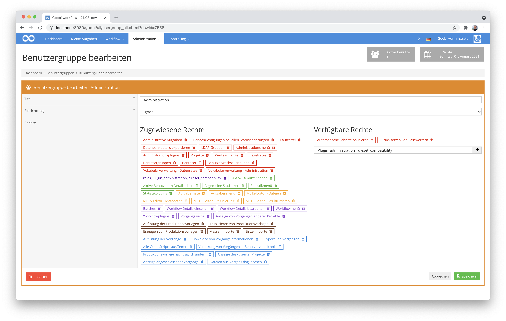
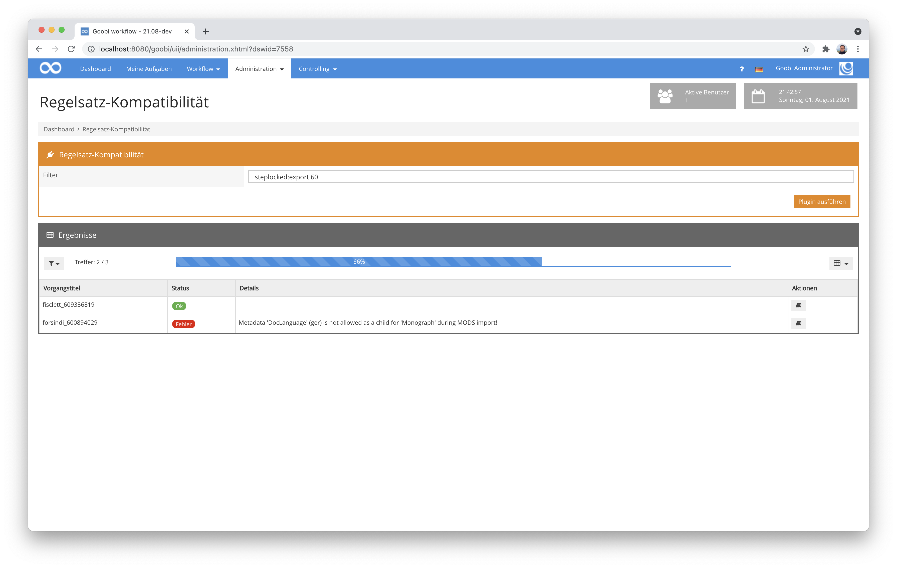

## Einführung
Die vorliegende Dokumentation beschreibt die Installation, die Konfiguration und den Einsatz des Administration Plugins für das automatisierte Prüfung einer großen Anzahl an Vorgängen innerhalb von Goobi workflow mit dem zugewiesenen Regelsatz. Eventuelle Inkompatibilitäten mit den jeweiligen Regelsätzen werden ermittelt und eine entsprechende Meldung über die konkrete Inkompatibilität angezeigt.


## Installation
Das Plugin besteht insgesamt aus den folgenden zu installierenden Dateien:

```bash
plugin_intranda_administration_ruleset_compatibility-base.jar
plugin_intranda_administration_ruleset_compatibility-gui.jar
plugin_intranda_administration_ruleset_compatibility.xml
```

Diese Dateien müssen in den richtigen Verzeichnissen installiert werden, so dass diese nach der Installation in folgenden Pfaden vorliegen:

```bash
/opt/digiverso/goobi/plugins/administration/plugin_intranda_administration_ruleset_compatibility-base.jar
/opt/digiverso/goobi/plugins/GUI/plugin_intranda_administration_ruleset_compatibility-gui.jar
/opt/digiverso/goobi/config/plugin_intranda_administration_ruleset_compatibility.xml
```

Für eine Nutzung dieses Plugins muss der Nutzer über die korrekte Rollenberechtigung verfügen. Bitte weisen Sie daher der Benutzergruppe die Rolle `Plugin_administration_ruleset_compatibility` zu.




## Überblick und Funktionsweise
Wenn das Plugin korrekt installiert und konfiguriert wurde, ist es innerhalb des Menüpunkts `Administration` zu finden. Nach dem Betreten können in der Oberfläche die oben beschriebenen Parameter noch einmal individuell angepasst werden.



Nach dem Klick auf den Button `Plugin ausführen` startet die Prüfung der METS-Dateien. Ein Fortschrittsbalken informiert über den Fortschritt. Innerhalb der Tabelle werden die bereits verarbeiteten Vorgänge aufgelistet. Eventuelle Inkompatibilitäten werden unmittelbar angezeigt. Darüber hinaus besteht die Möglichkeit, direkt den Metadateneditor einzelner Vorgänge zu betreten.


## Konfiguration
Die Konfiguration des Plugins erfolgt über die Konfigurationsdatei `plugin_intranda_administration_ruleset_compatibility.xml` und kann im laufenden Betrieb angepasst werden. Im folgenden ist eine beispielhafte Konfigurationsdatei aufgeführt:

{{CONFIG_CONTENT}}

| Parameter | Erläuterung |
| :--- | :--- |
| `filter` | Mit diesem Parameter kann ein Filter als Standard festgelegt werden. Dieser wird beim Betreten des Plugins automatisch vorausgefüllt, kann dann aber je nach Wunsch bei jeder Verwendung des Plugins innerhalb der Nutzeroberfläche angepasst werden. |
