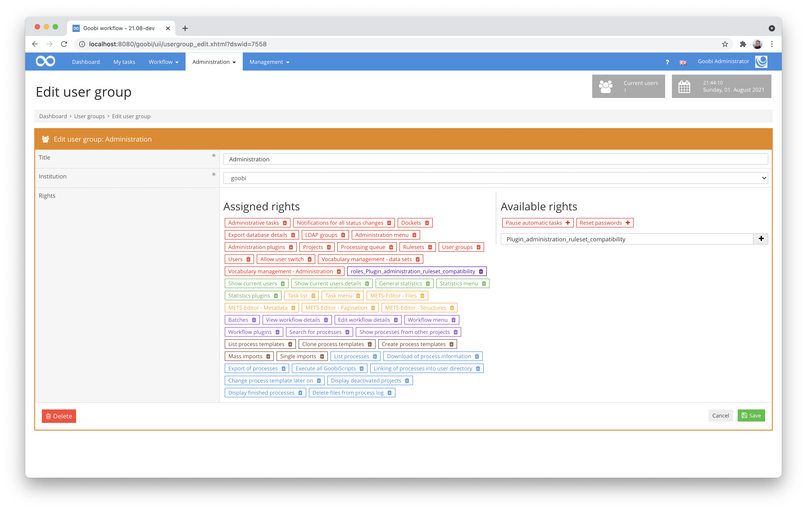

## Introduction
This documentation describes the installation, configuration and use of the Administration Plugin for automated checking of a large number of processes within Goobi workflow with the assigned rule set. Any incompatibilities with the respective rule sets are identified and a corresponding message about the specific incompatibility is displayed.


## Installation
The plugin consists of the following files to be installed:

```bash
plugin-intranda-administration-ruleset-compatibility-base.jar
plugin-intranda-administration-ruleset-compatibility-gui.jar
plugin_intranda_administration_ruleset_compatibility.xml
```

These files must be installed in the correct directories so that they are available in the following paths after installation:

```bash
/opt/digiverso/goobi/plugins/administration/plugin-intranda-administration-ruleset-compatibility-base.jar
/opt/digiverso/goobi/plugins/GUI/plugin-intranda-administration-ruleset-compatibility-gui.jar
/opt/digiverso/goobi/config/plugin_intranda_administration_ruleset_compatibility.xml
```

To use this plugin, the user must have the correct role authorisation. Therefore, please assign the role `Plugin_administration_ruleset_compatibility` to the user group.




## Overview and functionality
If the plugin has been installed and configured correctly, it can be found under the menu item `Administration`. After accessing it, the parameters described above can be customised again in the interface.


After clicking on the button `Execute plugin` the check of the METS files starts. A progress bar informs about the progress. The processes already processed are listed within the table. Any incompatibilities are immediately displayed. In addition, it is possible to directly enter the metadata editor of individual processes.


## Configuration
The plugin is configured via the configuration file `plugin_intranda_administration_ruleset_compatibility.xml` and can be adapted during operation. The following is an example configuration file:

{{CONFIG_CONTENT}}

| Parameter | Explanation |
| :--- | :--- |
| `filter` | With this parameter, a filter can be set as the default. This is automatically pre-filled when entering the plugin, but can then be adjusted as desired each time the plugin is used within the user interface. |
